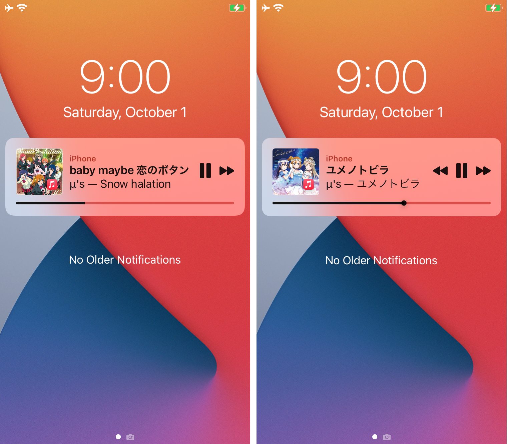

# Printemps

Very small music widget

## Preview

## Install

- `make package`

## License
[MIT](https://github.com/karin722/Printemps/blob/main/LICENSE)

## Contact
- [Twitter](https://twitter.com/tako3s)

## Credits
- Original
  - [TinyWidget14](https://github.com/p2kdev/TinyWidget14) under [MIT license](https://github.com/p2kdev/TinyWidget14/blob/main/LICENSE)
- Icon
  - [ikonate](https://github.com/mikolajdobrucki/ikonate) under [MIT license](https://github.com/mikolajdobrucki/ikonate/blob/master/LICENSE)