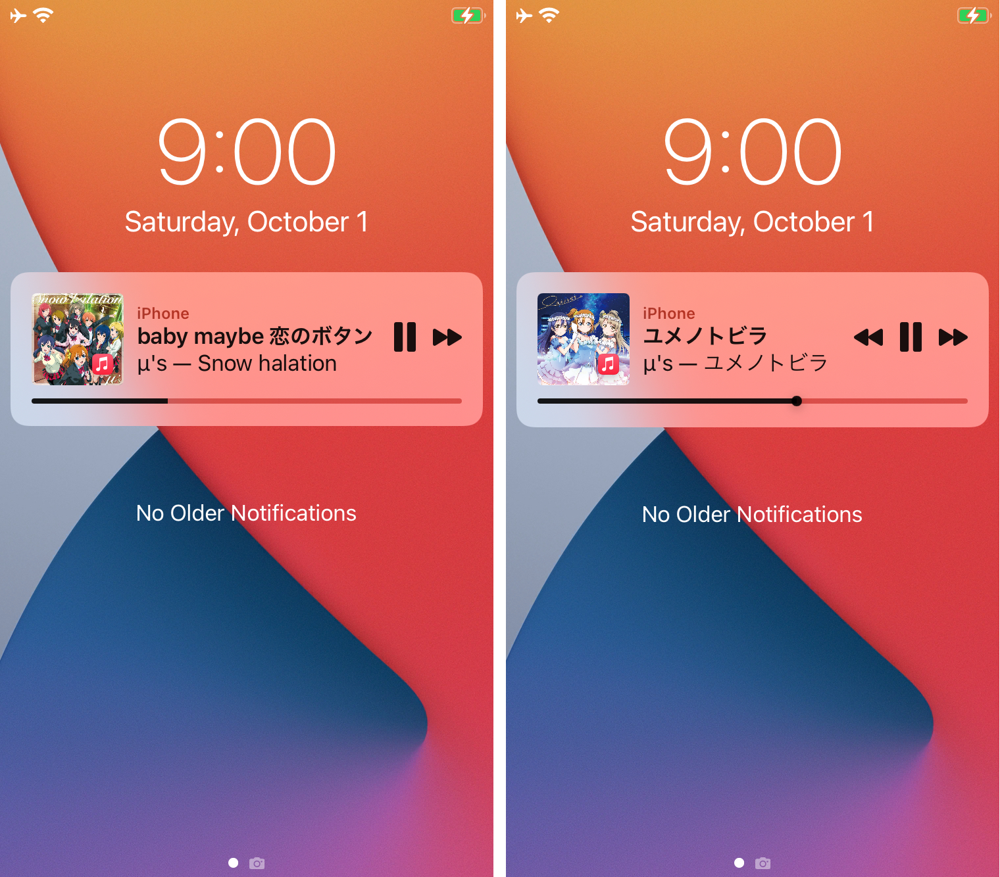

# Printemps

Very small music widget

## Preview

## Supported firmwares

Released for **iOS 16**, tested on 16.6.1. Printemps draws its own player on the
lock screen; the expanded player you get by tapping the artwork is Control
Center's, and is left stock.

iOS 16 turned the lock screen player into a live activity drawn in another
process: the cover sheet holds a `CSActivityItemContentView` whose content
arrives as a hosted scene layer, and there is not a single MediaControls view
left in SpringBoard to restyle. Printemps therefore builds its own player from
MediaRemote, puts it inside that activity item and sizes the card around it.
Only the activity in the `com.apple.MediaRemoteUI` group is touched, so other
live activities are left alone.

The iOS 14 and 15 code paths are still here, and `%ctor` picks between them at
load time. There the lock screen player is a `MRUNowPlayingView` inside
SpringBoard and Printemps restyles it in place, the way it always did. The
released package does not install below iOS 16 because those paths are no
longer tested, but they still build: drop the rootless scheme as described below
for a rootful iOS 14/15 package.

## Install

- `make package`

Needs `iPhoneOS16.5.sdk` from [theos/sdks](https://github.com/theos/sdks): it is
the oldest SDK that can build the iOS 16 code paths, and unlike Xcode's own SDK
it carries the PrivateFrameworks the preference bundle links against.

Packages are built with the rootless scheme. For a rootful build, drop
`THEOS_PACKAGE_SCHEME=rootless` from `Makefile` and `PrintempsPrefs/Makefile`
and set `Architecture: iphoneos-arm` in `control`.

## Reporting a layout problem

Turn on *debug logging* in the Printemps settings, respring, then read
`/var/mobile/Library/Logs/Printemps.log`. It records the player's `layout` and
`context` values, the view controllers it sits under and the frames that were
applied, which is what the layout constants at the top of `Tweak.xm` are tuned
against. The same lines go to the system log.

Printemps always logs one line when it is injected, whether or not debug
logging is on, so an empty system log means the tweak was never loaded.

## License
[MIT](https://github.com/karin722/Printemps/blob/main/LICENSE)

## Contact
- [Twitter](https://twitter.com/tako3s)

## Credits
- Original
  - [TinyWidget14](https://github.com/p2kdev/TinyWidget14) under [MIT license](https://github.com/p2kdev/TinyWidget14/blob/main/LICENSE)
- Icon
  - [ikonate](https://github.com/mikolajdobrucki/ikonate) under [MIT license](https://github.com/mikolajdobrucki/ikonate/blob/master/LICENSE)
